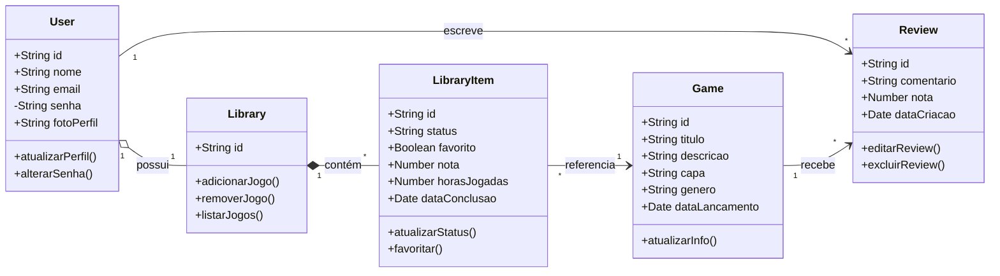

# Gamer Profile

Sistema web para gerenciamento de biblioteca pessoal de jogos.

## Funcionalidades
- Adicionar jogos à biblioteca
- Marcar jogos como favoritos 
- Fazer review de jogos
- Criar wishlist

## Classes do domínio

### 1. User
Representa o usuário do sistema.

#### Responsabilidade (SRP):
- Gerenciar apenas informações e comportamentos do usuário.
#### Motivo único para mudar:
- Mudanças relacionadas aos dados do usuário ou autenticação.
##
### 2. Game
Representa um jogo cadastrado na plataforma.

#### Responsabilidade (SRP):
- Armazenar informações gerais de um jogo.
#### Motivo único para mudar:
- Mudanças nos dados de jogos.
##
### 3. Library
Representa a biblioteca pessoal do usuário.

#### Responsabilidade (SRP):
- Gerenciar os jogos pertencentes ao usuário.
#### Motivo único para mudar:
- Mudanças na organização da biblioteca.
##
### 4. LibraryItem
Representa um jogo dentro da biblioteca do usuário.

#### Responsabilidade (SRP):
- Controlar o estado do jogo para um usuário específico.
#### Motivo único para mudar:
- Mudanças relacionadas ao progresso ou status do jogo.
##
### 5. Review
Representa uma avaliação textual feita por um usuário.

#### Responsabilidade (SRP):
- Gerenciar reviews de jogos.
#### Motivo único para mudar:
- Mudanças no sistema de avaliações.

## Relações entre as classes

### Agregação
User ◇── Library
- Um usuário possui uma biblioteca.
- A biblioteca pode existir separadamente no sistema.
##
### Composição
Library ◆── LibraryItem
- A biblioteca é composta por itens.
- Se a biblioteca for removida, os itens também são.
##
### Associação
LibraryItem ── Game
- Um item da biblioteca referencia um jogo.

Review ── User

Review ── Game
- Uma review pertence a um usuário e a um jogo.

## Diagrama UML



## Aplicação do DIP (Dependency Inversion Principle)

Módulos de alto nível dependem de abstrações, e não de implementações concretas.

## Estrutura de dependências

### UserService

```text
UserService
     ↓
IUserRepository
     ↑
UserRepositoryMongo
```

- `UserService` depende da abstração `IUserRepository`
- `UserRepositoryMongo` implementa essa interface

---

### GameService

```text
GameService
     ↓
IGameRepository
     ↑
GameRepositoryMongo
```

---

### ReviewService

```text
ReviewService
      ↓
IReviewRepository
      ↑
ReviewRepositoryMongo
```
