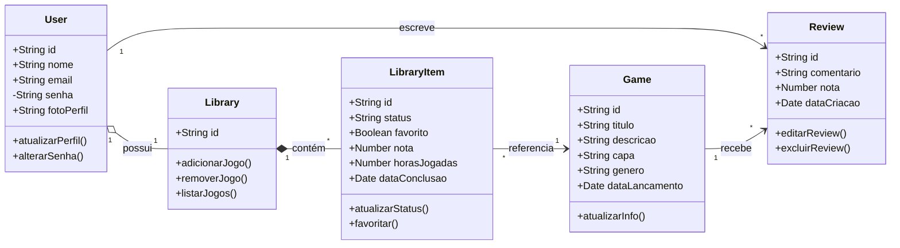

# Gamer Profile

Sistema web para gerenciamento de biblioteca pessoal de jogos

## Como acessar
Frontend: https://gamer-profile-eight.vercel.app

API: https://gamerprofile.onrender.com

Documentação Swagger:
https://gamerprofile.onrender.com/docs

## Funcionalidades
- Cadastrar usuários
- Adicionar jogos à biblioteca
- Fazer review de jogo

## Tecnologias utilizadas

### Frontend
- HTML5
- CSS3
- JavaScript (Vanilla JS)
- Bootstrap 5

### Backend
- Node.js
- Express.js
- SQLite (banco de dados local)
- Swagger/OpenAPI (documentação da API)

### Deploy
- Render (hospedagem da API)
- Vercel (hospedagem do frontend)

## Endpoints da API

### Usuários

| Método | Rota | Descrição |
|--------|------|-----------|
| GET | `/users` | Lista todos os usuários |
| GET | `/users/:id` | Busca um usuário pelo ID |
| POST | `/users` | Cadastra um novo usuário |
| PUT | `/users/:id` | Atualiza os dados de um usuário |
| DELETE | `/users/:id` | Remove um usuário |

### Jogos

| Método | Rota | Descrição |
|--------|------|-----------|
| GET | `/games` | Lista todos os jogos |
| GET | `/games/:id` | Busca um jogo pelo ID |
| POST | `/games` | Cadastra um novo jogo |
| PUT | `/games/:id` | Atualiza os dados de um jogo |
| DELETE | `/games/:id` | Remove um jogo |

### Reviews

| Método | Rota | Descrição |
|--------|------|-----------|
| GET | `/reviews` | Lista todas as reviews |
| GET | `/reviews/:id` | Busca uma review pelo ID |
| POST | `/reviews` | Cria uma nova review relacionando usuário e jogo |
| PUT | `/reviews/:id` | Atualiza uma review existente |
| DELETE | `/reviews/:id` | Remove uma review |

## Estrutura de pastas

```
gamer-profile/
├── backend/
│   ├── src/
│   │   ├── controllers/
│   │   ├── docs/
│   │   ├── middleware/
│   │   ├── models/
│   │   ├── routes/
│   │   ├── services/
│   │   ├── app.js
│   │   ├── db.js
│   │   └── server.js
|   ├── .gitignore
|   ├── package-lock.json
│   └── package.json
│
├── frontend/
│   ├── css/
│   ├── js/
│   │   ├── services/
│   │   ├── ui/
│   │   ├── api.js
│   │   ├── config.js
│   │   └── main.js
│   └── index.html
│
└── README.md
```

## Arquitetura do projeto

OBS.: O projeto foi modelado considerando cinco entidades de domínio. A implementação atual contempla User, Game e Review, enquanto Library e LibraryItem representam uma possível evolução futura.

## Classes do domínio

### 1. User
Representa o usuário do sistema.

#### Responsabilidade (SRP):
- Gerenciar apenas informações e comportamentos do usuário.
#### Motivo único para mudar:
- Mudanças relacionadas aos dados do usuário ou autenticação.
##
### 2. Game
Representa um jogo cadastrado na plataforma.

#### Responsabilidade (SRP):
- Armazenar informações gerais de um jogo.
#### Motivo único para mudar:
- Mudanças nos dados de jogos.
##
### 3. Library
Representa a biblioteca pessoal do usuário.

#### Responsabilidade (SRP):
- Gerenciar os jogos pertencentes ao usuário.
#### Motivo único para mudar:
- Mudanças na organização da biblioteca.
##
### 4. LibraryItem
Representa um jogo dentro da biblioteca do usuário.

#### Responsabilidade (SRP):
- Controlar o estado do jogo para um usuário específico.
#### Motivo único para mudar:
- Mudanças relacionadas ao progresso ou status do jogo.
##
### 5. Review
Representa uma avaliação textual feita por um usuário.

#### Responsabilidade (SRP):
- Gerenciar reviews de jogos.
#### Motivo único para mudar:
- Mudanças no sistema de avaliações.

## Relações entre as classes

### Agregação
User ◇── Library
- Um usuário possui uma biblioteca.
- A biblioteca pode existir separadamente no sistema.
##
### Composição
Library ◆── LibraryItem
- A biblioteca é composta por itens.
- Se a biblioteca for removida, os itens também são.
##
### Associação
LibraryItem ── Game
- Um item da biblioteca referencia um jogo.

Review ── User

Review ── Game
- Uma review pertence a um usuário e a um jogo.

## Diagrama UML


